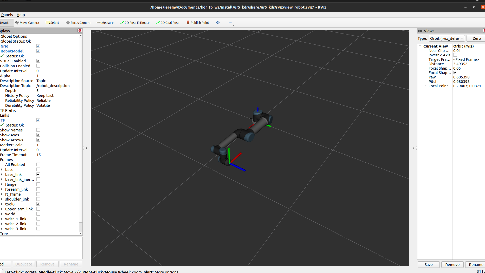

# KDR_Final_Project 

This repository hosts the code for completing Part 3 of the final project for 535.630 Kinematics & Dynamics for Robots. It is designed to guide you through the UR5 robot visualization in ROS2 using the trajectory you generated.

- Author: Jeremy Zhang

## Prerequists

Before you download this repository to your local disk, make sure your computer meets the requirements. Here is the checklist you may want to go through:

- [ ] OS: Ubuntu 20.04
- [ ] ROS 2 Galactic
- [ ] Universal Robot ROS2 Driver
- [ ] Git

You can go to any section if you find your computer doesn't satisfy that requirement. 

###  1. Operating System (OS): Ubuntu 20.04 + ROS 2 Galactic

For dual-booting your machine and install ROS 2, please refer to the ROS2 installation guide uploaded on Canvas.

### 2. Universal Robot ROS2 Driver

Open a new terminal and type in the command:

```bash
source /opt/ros/galactic/setup.bash
```

Update the packages

````bash
sudo apt update
````

```bash
sudo apt upgrade
```

Then install the UR robot driver using its debian package

```bash
sudo apt-get install ros-galactic-ur-robot-driver
```

### 3. Git

Git is a very important tool for code management, to install git, simply open a new terminal and type in:

Update the packages

````bash
sudo apt update
````

```bash
sudo apt upgrade
```

Install git from debian package

```bash
sudo apt-get install git-all
```


## Download this package

Open a new terminal

```bash
source /opt/ros/galactic/setup.bash
```

Create a new folder for this project:

```bash
mkdir -p ~/kdr_workspace/src
```

Get into the folder you just created:

```bash
cd ~/kdr_workspace/src
```

Clone this repository to the directory you are in:

```bash
git clone https://github.com/jmz3/KDR_Final_Project.git
```

If you cannot use `git clone`, alternatively download the zip file is OK. But you need to unzip the file and put the contents into  `~/kdr_workspace/src` 


After this step, your directory structure should be like:

```bash
~/kdr_workspace
└── src
    ├── matab
    │   ├── tf_frame.m
    │   ├── ur5_interface.m
    │   └── ur5_move_ros2.m
    ├── README.md
    └── ur5_kdr
        ├── CMakeLists.txt
        ├── launch
        │   ├── ur5_interface.launch.py
        │   └── ur5_simulation.launch.py
        ├── package.xml
        ├── rviz
        │   └── view_robot.rviz
        └── src
            └── frame_publisher.cpp

```

If you structure is not the same as I'm showing here, put the corresponding file into the right position. Do not proceed to the next step until you have the correct arrangement of the codes.


## Usage

To have the simulation running, you need to have a new terminal:

```bash
cd ~/kdr_workspace
```

and upload all the environment variables

```bash
source /opt/ros/galactic/setup.bash
```

Build the package

```bash
colcon build
```

Source the local environment variables

```bash
source install/setup.bash
```

Then launch the ur5 simulation

```bash	
ros2 launch ur5_kdr ur5_simulation.launch.py 
```

After you launch this python script, you will see a UR5 lying down on the ground:




Now you can open your Matlab in the same directory and navigate to `~/kdr_workspace/src/matlab` and run the program `ur5_move_ros2.m`. The robot should move to a new configuration as commanded.


## For Clarity

ROS using a thing called TOPIC to transfer messages between everything, you can open a new terminal and setup the environment

```bash
source /opt/ros/galactic/setup.bash
```

And if you type in the following command, you will find you can see the commands you send from MATLAB are shown here

```bash
ros2 topic echo /joint_trajectory_controller/joint_trajectory
```

The robot simply "listens" to this topic and do whatever it receives from this topic
